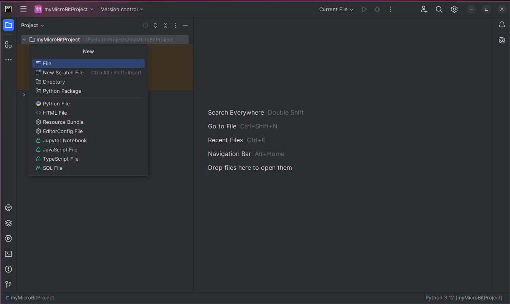

Let's add a Python file to our project.

After opening PyCharm, click the _hamburger_ icon on the upper left 
to view the main menu.

The main menu now appears at the top of the screen.

Hover your mouse pointer over the _File_ selection and then click on _New..._.

Now click on _Directory_.

A dialog box appears in the center of the screen to enter a directory name.

Let's call this directory _button_test_. After entering the name, hit the _Enter_ key.

The new directory appears in the project panel.

