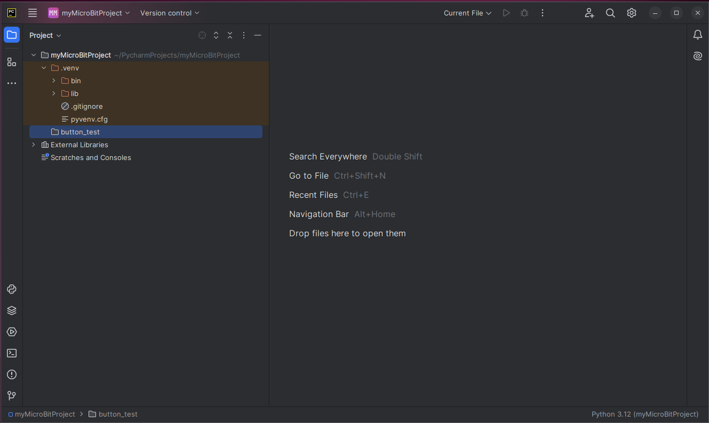
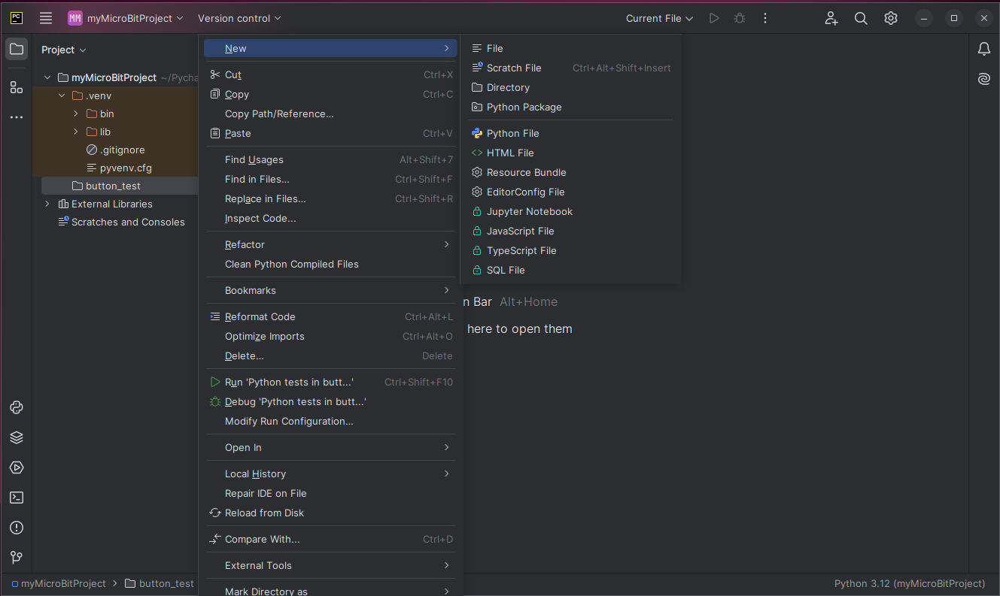
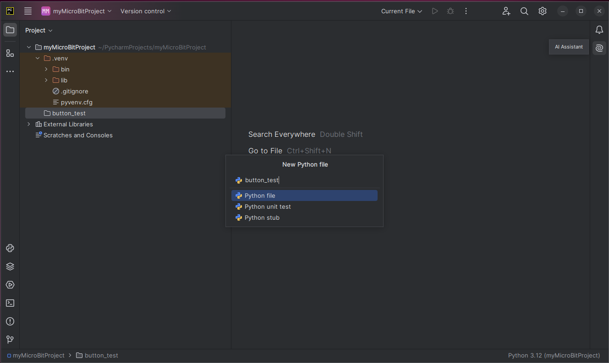
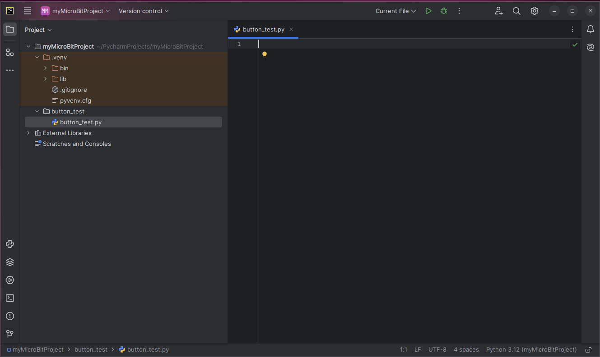
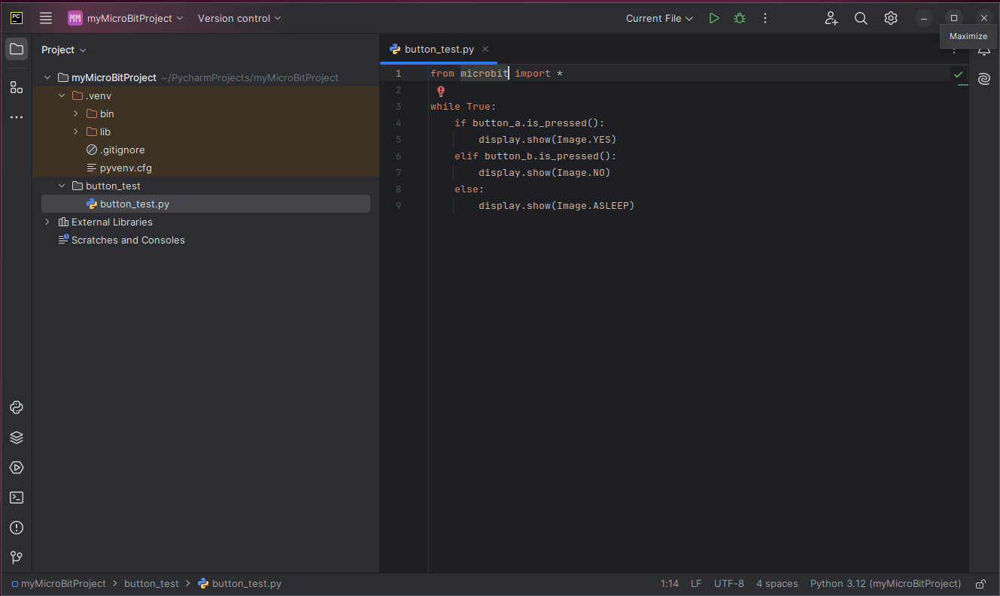

We want to create a file within a directory we created in the 
previous section.

Hover your mouse pointer over the directory name.

Right-click your mouse, and 
hover over _New_, and select _Python File_.

A dialog box appears in the center of the screen to enter a name for the
new file. The name we will enter is _button_test_. Now, hit the _Enter_ key.

Note that you do not need to add the .py extension. Pycharm will do that 
automatically for you.

Pycharm adds the new file to the Project panel and opens the file in the editor.

We now type in our code. For demonstration purposes, 
I initially misspelled microbit in the import statement.

PyCharm flags errors by underlining the error with a red wavy line.

Changing microbix to microbit resolves all the errors.

