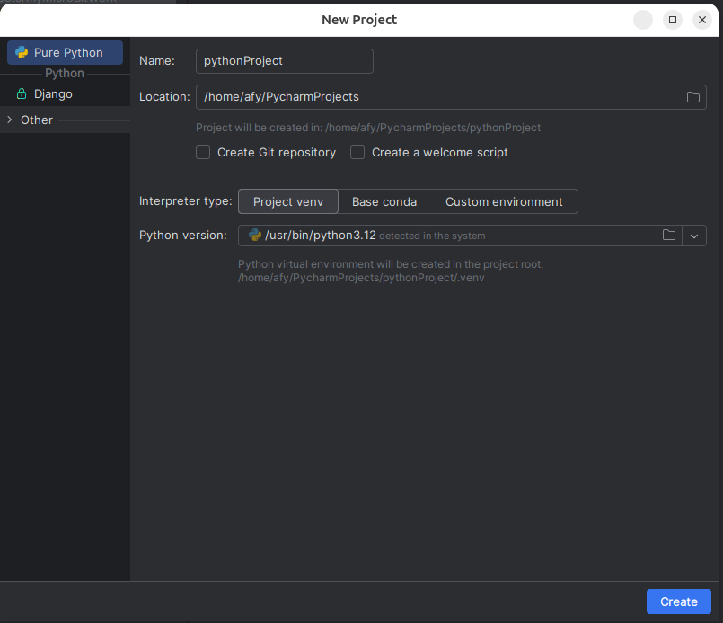
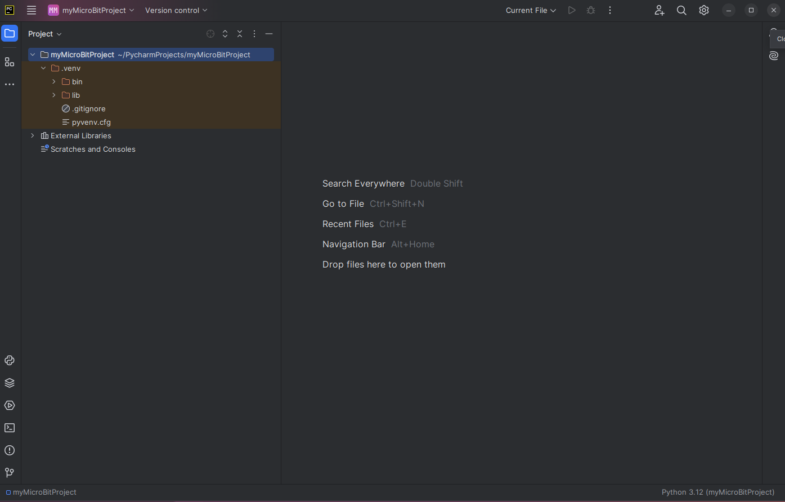

In the _Name_ field enter whatever you wish to call the project. 
I will be calling my project _MyMicroBitProject_.

Click the Create button at the bottom of the window. The new project will
appear.

