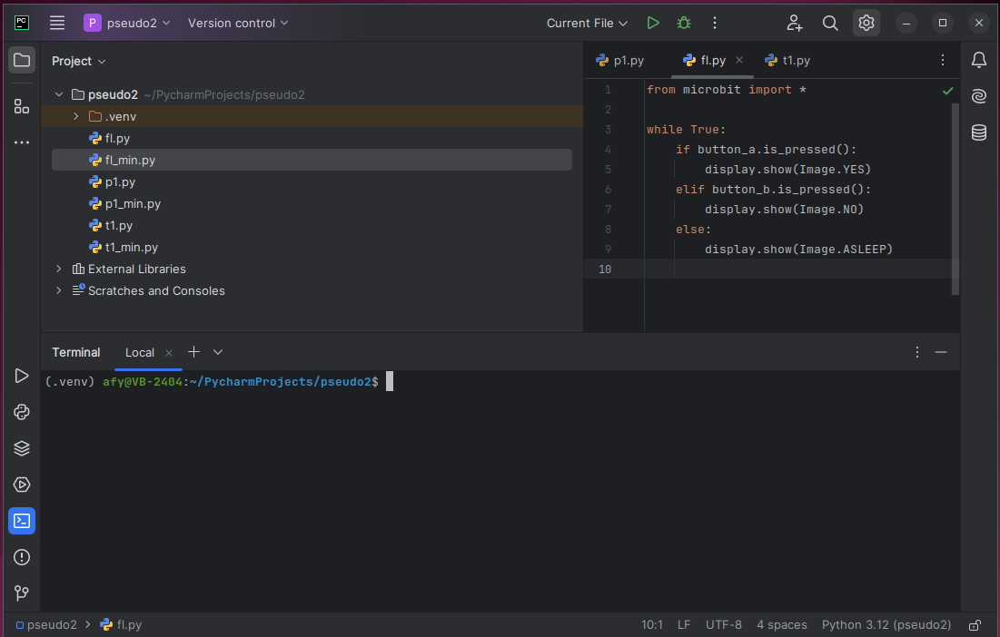

PyCharm allows us to configure third-party command-line applications to run as 
**_External Tools_** from within PyCharm. 

We will now configure [python-minimizer](https://github.com/agroden/python-minimizer), 
[uflash](https://github.com/ntoll/uflash), 
and [microfs](https://github.com/ntoll/microfs) as external tools.

The **_python-minimizer_** utility compresses a Python source file by removing as much
white space as possible. The micro:bit has limited memory space, and minimizing
source files allows us to install the largest file possible.

The **_uflash_** utility is used to flash the BBC micro:bit with Python scripts.

The **_microfs_** utility allows interaction with the limited file system provided 
by MicroPython on the BBC micro:bit. Using this utility, you can list the files 
on the device, copy a file to the micro:bit file system, and retrieve a file from the
micro:bit filesystem.

PyCharm provides a built-in terminal, so if you prefer to interact with 
any of these utilities directly via the command line, you may do so.

 

