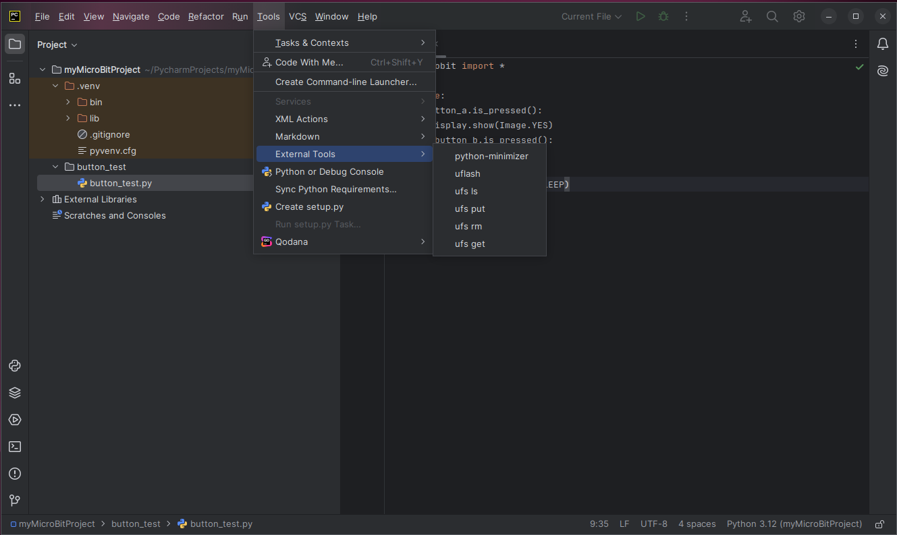
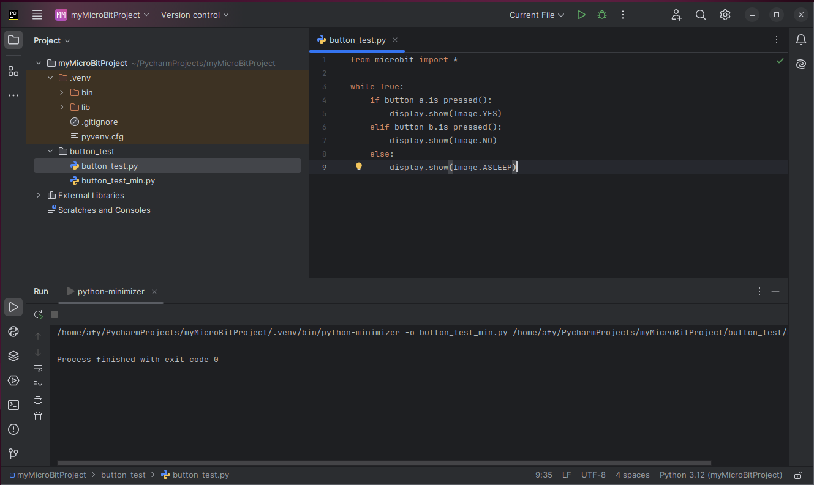

To minimize a Python file, select the desired file in the _Project_ panel.

Click on the _hamburger_ icon to bring up the main menu. Slide the mouse over the _Tools_
selection and then select _External Tools_ and click on _python-minimizer._

The results of the call to python-minimizer are shown in the Run window at the
bottom of the screen. And since there were no errors, a new file is added to
the button_test directory named button_test_min.py.

This file is now ready to be flashed to the micro:bit.

