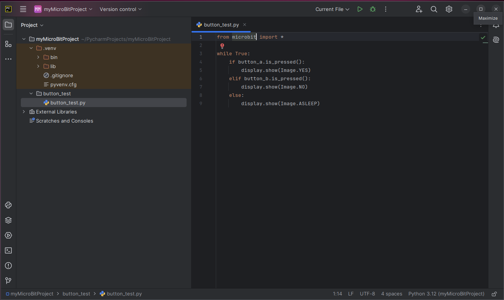

Select the desired file in the Project panel to minimize a Python file.

Click on the _hamburger_ icon to bring up the main menu. 
Slide the mouse over the _Tools_ selection, 
select _External Tools_, and click on _uflash_.

The results of the call to python-minimizer are shown in the _Run_ window at the
bottom of the screen. Since there were no errors, 
a new file named button_test_min.py is added to the button_test directory.

This file is now ready to be flashed to the micro:bit.

