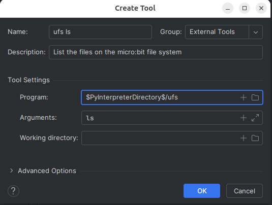
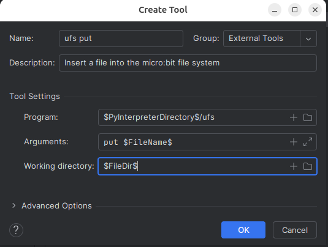
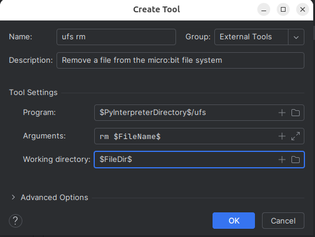

The microfs utility interacts with the limited file system 
provided by MicroPython on the BBC micro:bit. 
It is invoked using the command named _ufs_.

## Attention Linux Users

You may need to add your username to the dialout group to access the serial
port. Is not you may see a permission denied message when trying to use the
ufs commands.

To add your self to the dialout group, open a terminal window and type the following:

sudo usermod -a -G dialout YOUR_LINUX_LOGIN_ID

Then reboot the operating system.

## Creating External Tools For UFS

We will create an **External Tool** for the following ufs commands:

* ls - list the files in the file system
* put - place a file into the file system
* rm - remove a file from the file system
* get - retrieve a file from the file system

For each of the commands we will select Settings/Tool/External Tools
from the Settings 
then fill in the fields for each command

### ufs ls

* **Program**: $PyInterpreterDirectory$/ufs
* **Arguments**: ls
* **Working Directory**: left blank

### ufs put

* **Program**: $PyInterpreterDirectory$/ufs
* **Arguments**: put $FileName$
* **Working Directory**: $FileDir$

### ufs rm

* **Program**: $PyInterpreterDirectory$/ufs
* **Arguments**: rm $FileName$
* **Working Directory**: $FileDir$

### ufs get

* **Program**: $PyInterpreterDirectory$/ufs
* **Arguments**: get $FileName$
* **Working Directory**: $FileDir$

