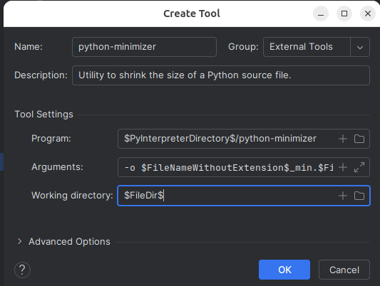

Open the Settings dialog by clicking on the gear wheel in the upper right-hand corner.

Select _Settings_

On the left side of the Settings screen, expand the _Tools_ entry, 
and then select 
_External Tools_.

Click on the _Plus_ sign.

Now let's fill in the specifics for _python-minimizer_.

Enter a name for the tool in the name field. You can name it anything you like.

Enter a description for the tool.

In the Tool Settings section, we need to enter the _Program_. The Program field
contains a path to the command the tool will execute.

PyCharm uses macros to help create the entries. If you press the Plus sign 
on the
right of the _Program_ field, a list of available macros is shown. To add a macro,
select the desired option in the list and press _Insert_.

The macro will be expanded in the macro preview window and added to the field.

The **Program** field should be edited to contain:

**$PyInterpreterDirectory$/python-minimizer**

After inserting the **$PyInterpreterDirectory$**, we manually append a slash and
name of the python-minimizer command.

Next we add the command arguments to the Arguments field. I prefer to not have 
original source file minified, but instead to create a new file that has "_min" 
appended to the file name.

To do this we use the following arguments:

**-o $FileNameWithoutExtension$_min.$FileExt$ $FilePath$**

The -o options specifies the output file, and $FilePath$ specifies the
input file.

The **Working Directory** is set to **$FileDir$**

When you have completed entering all the information, click OK and you should see that
python-minimizer external tool was created.

