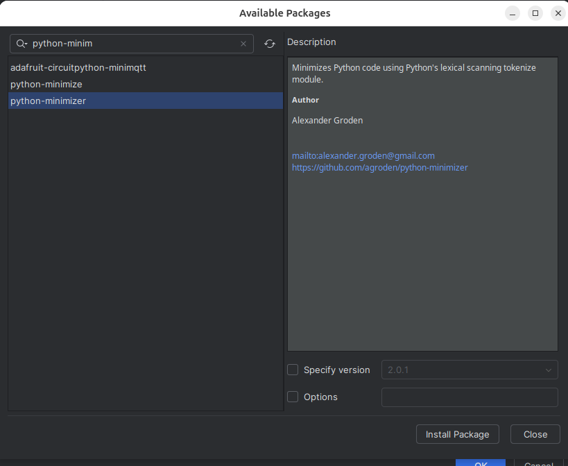
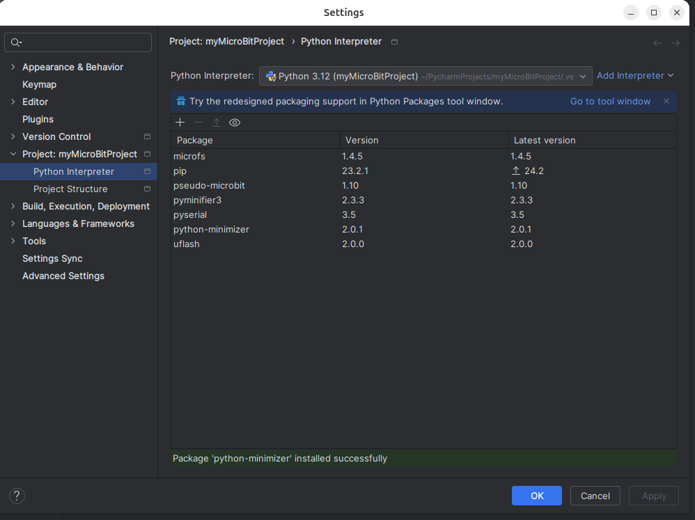

We now need to install python-minimizer to the project. This utility allows us
to shrink Python files so that they take the minimum amount of space when flashing
the code to the micro:bit.

Click on the _plus_ sign again, and in the search field, type _python-minimizer_. As 
you type in the name, PyCharm provides possible matches. Select _python-minimizer_
 and
press _Install Package_.

After the package installs, click _Close._

Click the _OK_ button.
