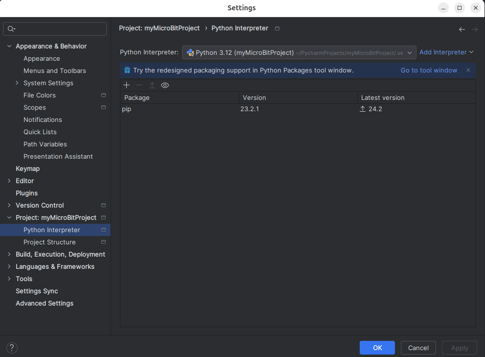
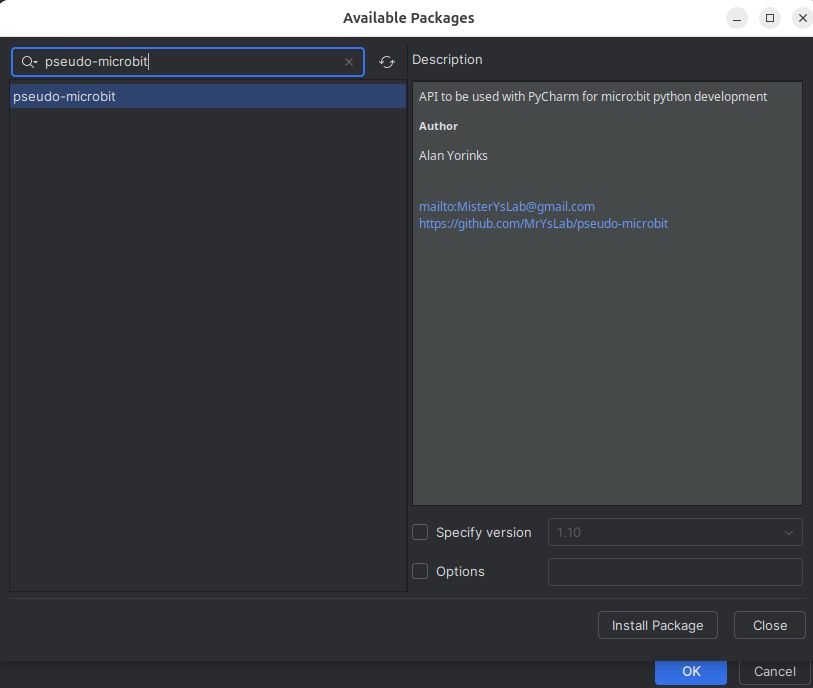
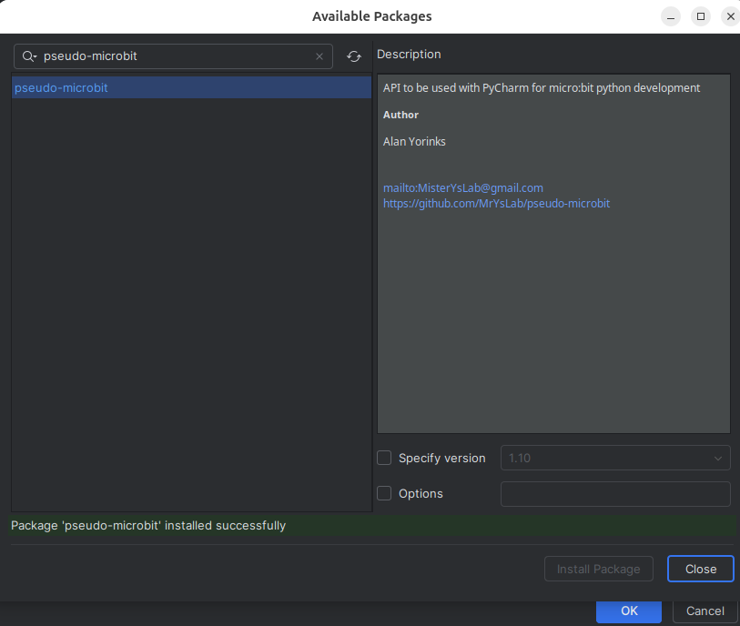
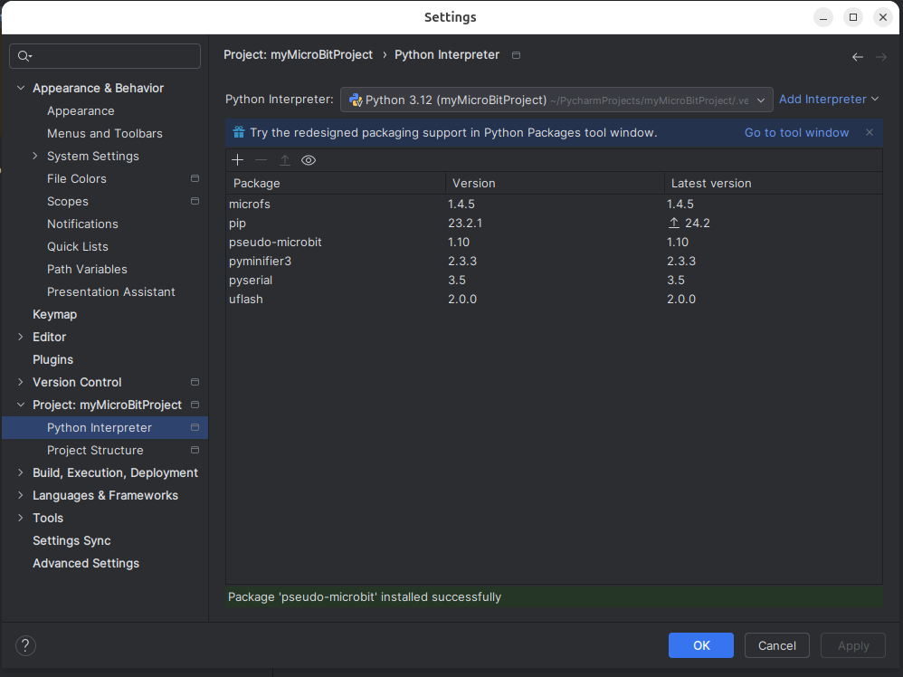

Open the Settings dialog by clicking on the gear wheel in the upper right hand corner.

Select _Settings_

On the left side of the Settings screen, expand the _Project_ entry, 
and then select 
_Python Interpreter_.

Click on the _Plus_ sign just above the _Package_ column.

In the _Available Packages_ dialog, enter pseudo-microbit in the search field.

Click the _Install Package_ button when it becomes active.

When you see Package Installed Successfully message appear, click on close.

The results of the install are displayed.

