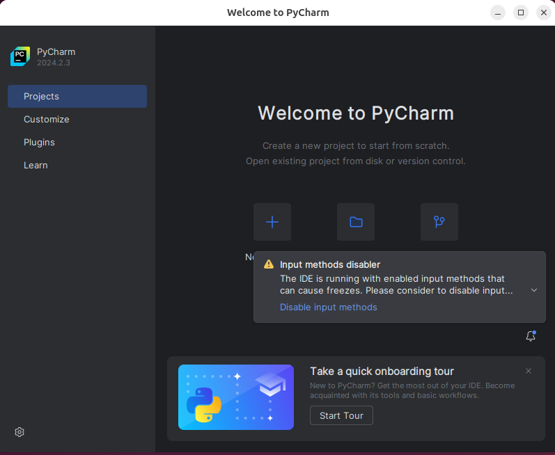

The pseudo-microbit package is compatible with the free community edition and 
non-free professional edition
versions of PyCharm. 

To install PyCharm, go to the 
[PyCharm web page](https://www.jetbrains.com/pycharm/), 
download your desired version, and install it on your computer.

Some operating systems, such as Ubuntu and Fedora Linux, offer PyCharm 
in their "software stores." If you use 
one of the stores, you do not need to download anything from the website above.

Start PyCharm after it installs. You should see something like 
the following screen:

If you are prompted to disable input methods, you should do so.

In PyCharm, a _project_ is an organizational unit representing 
a complete software solution. It's where you'll manage all your files, 
settings, and configurations for a specific software development task.

Once your project is set up, this is where you'll create 
your micro:bit MicroPython source files. These files will be 
located within your project's directory, which you can access from 
the PyCharm interface.

Click on the Plus sign button to create a new PyCharm project. The New Project
dialog will appear.

