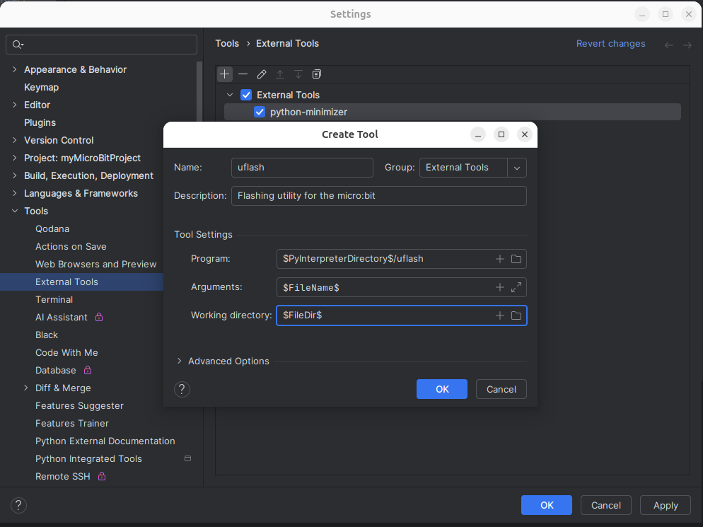
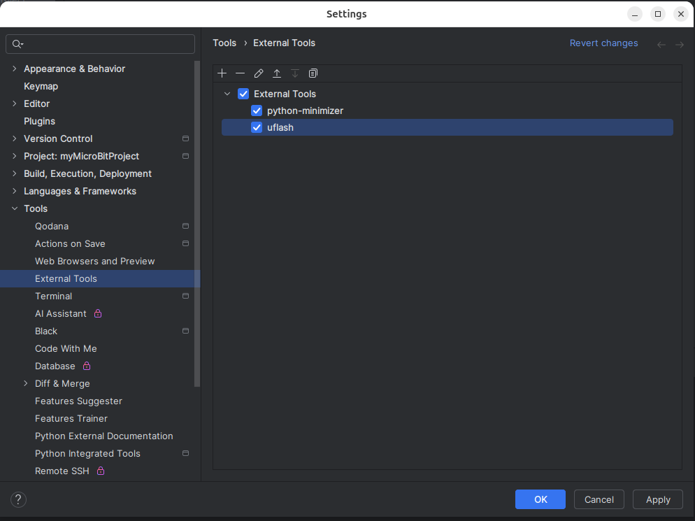

The uflash utility is used to flash Python scripts to the BBC micro:bit.

Once again, we select Settings/Tool/External Tools from the Settings menu and press
the Plus sign. We then fill in the fields:

**Name**: uflash

**Description**: Flashing utility for the micro:bit

**Program**: $PyInterpreterDirectory$/uflash

**Working Directory**: $FileDir$

When complete, we click on OK.

The uflash utility has been added to the list of external tools.

