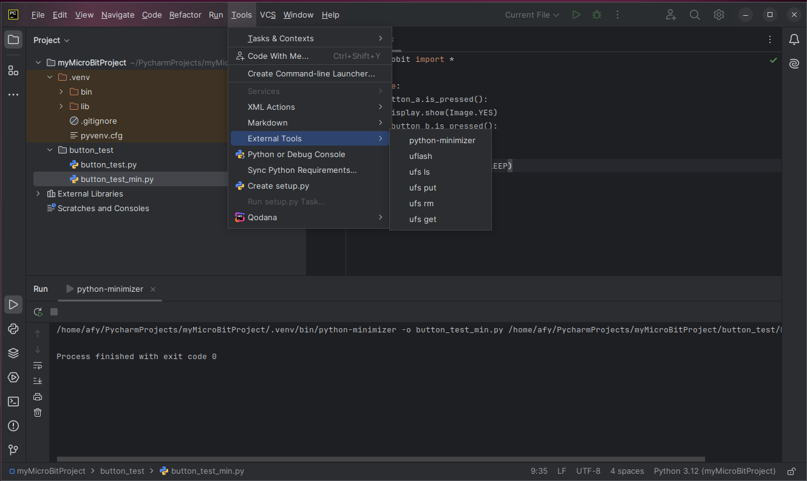

To upload a Python file to the micro:bit, 
connect the micro:bit to your computer and select the desired Python file in the 
_Project_ 
panel.

Click on the _hamburger_ icon to bring up the main menu. Slide the mouse over the _Tools_
selection and then select _External Tools_ and click on _uflash._

When the upload completes, the results are displayed in the Run window 
at the
bottom of the screen.

