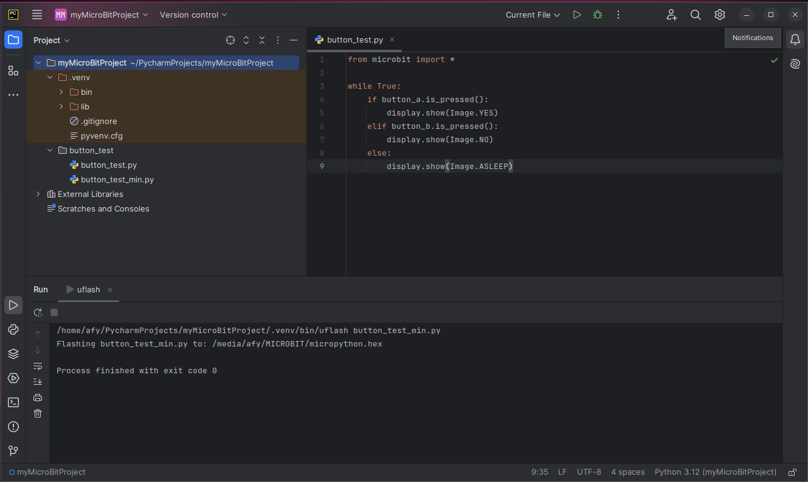
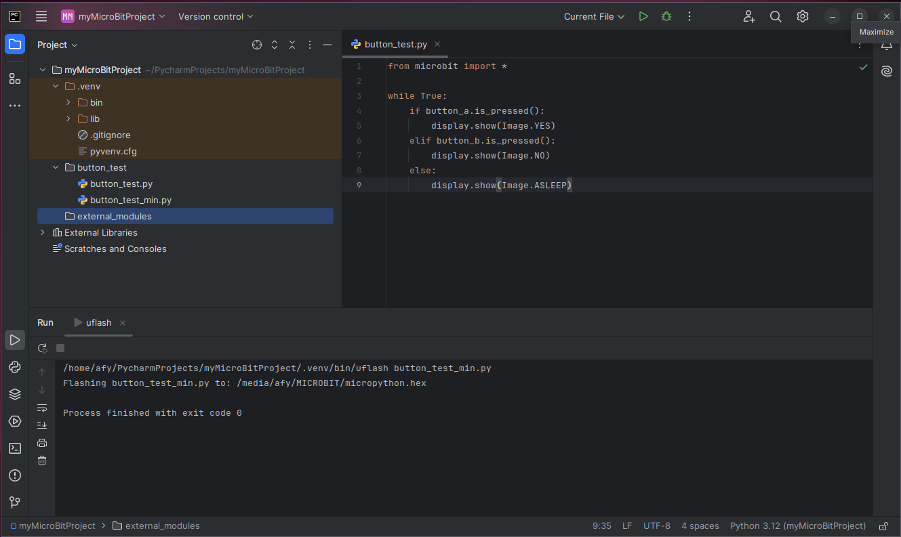
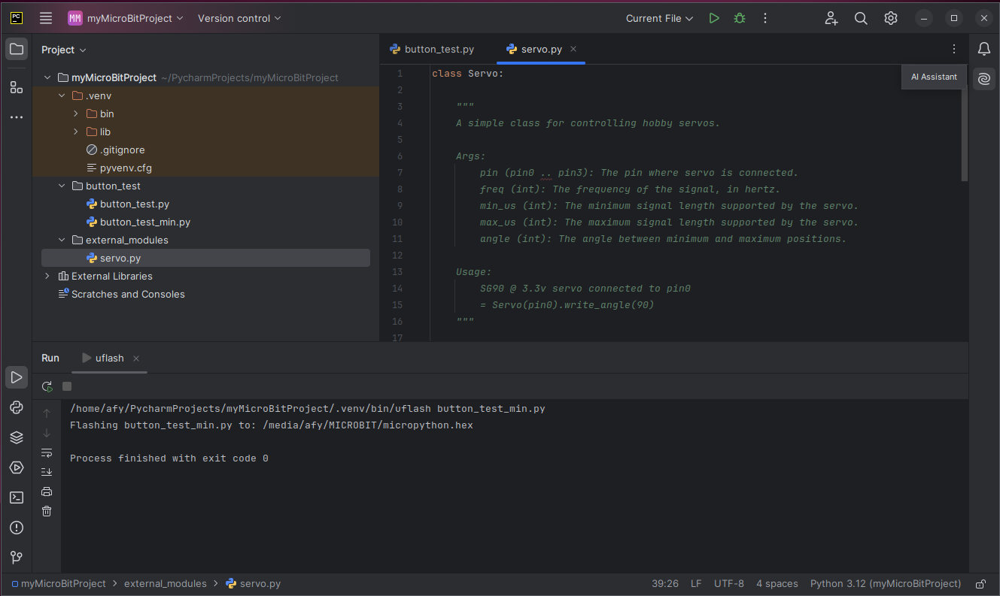
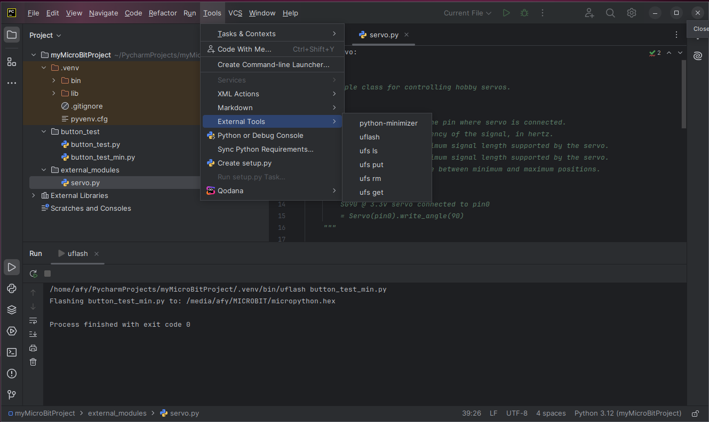
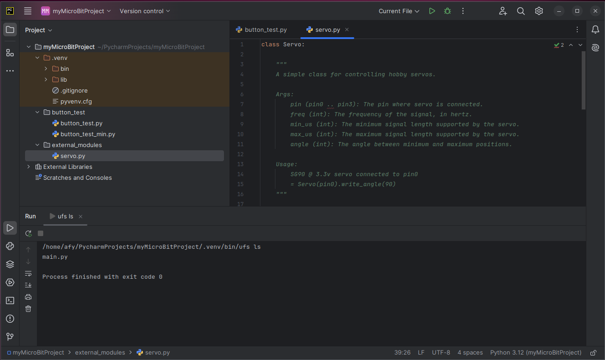
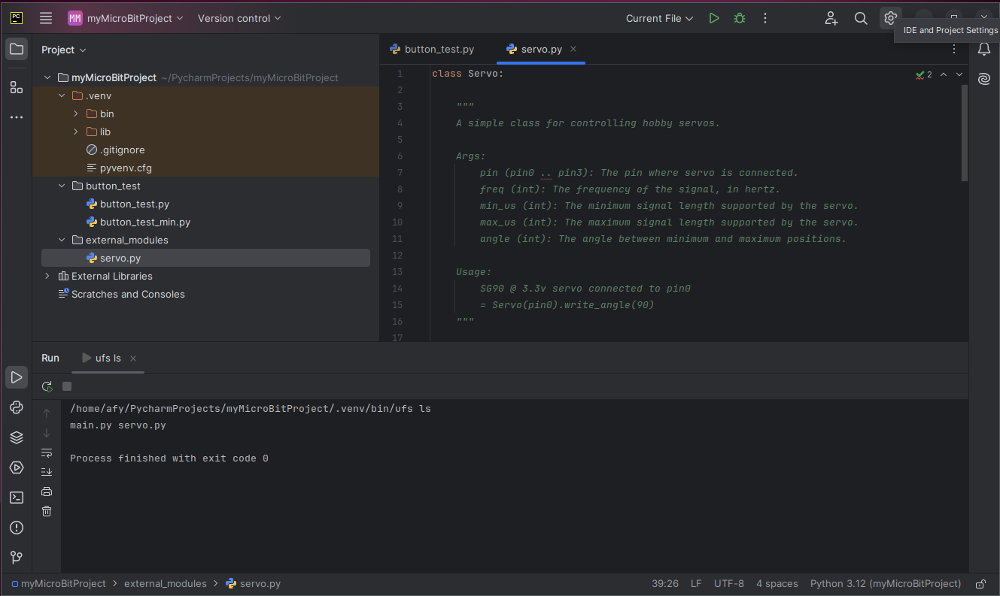

Sometimes, you may wish to add functionality to your project 
that is not part of the standard micro:bit library.
To import and gain access to the module, you will need to place the 
library in the micro:bit persistent file system.

The [servo library](https://github.com/microbit-playground/microbit-servo-class) 
is a prime example of such a module. 
The servo distribution explicitly instructs on how to
import an external module. Just click the servo library link 
to view the instructions. However, we will use the External tools to work with the micro:bit persistent file system.

First, we will create a new directory called external_files by 
clicking on the project name at the top of the Project panel.

Follow the instructions 
[here](add_directory.md)
to add the new directory.
Name the new
directory _external_modules_.

Now, create a file called _servo.py_ in that directory. Refer to 
[this section](add_file.md) 
for creating files.

Copy the code from the 
[servo library](https://github.com/microbit-playground/microbit-servo-class) into
the file.

Before adding servo.py to the 
micro:bit persistent file system, let's examine the persistent file system's contents.

Select Tools/External Tools from the main 
menu by first clicking on the Hamburger icon.

Click on _ufs ls_.
The results are displayed in the Run panel at the bottom of the screen. The file
main.py is displayed. This is a default file that is preinstalled with the
persistent file system.

Now, let's upload _servo.py_ to the persistent file system.

First, we select servo.py in the Project panel and then choose _ufs put_ in the External Tools menu.

If we now execute _ufs ls_ again, we see that servo.py has been added.

If we now execute a _ufs rm_ followed by a _ufs ls_, we see that the file was
removed.

If you wish to retrieve a file from the persistent file system using 
_ufs get_, you must first have a file in the project with the name of the file
you want 
to retrieve, and then select that file name in the Project panel, 
execute the _ufs get_ 
external tool.